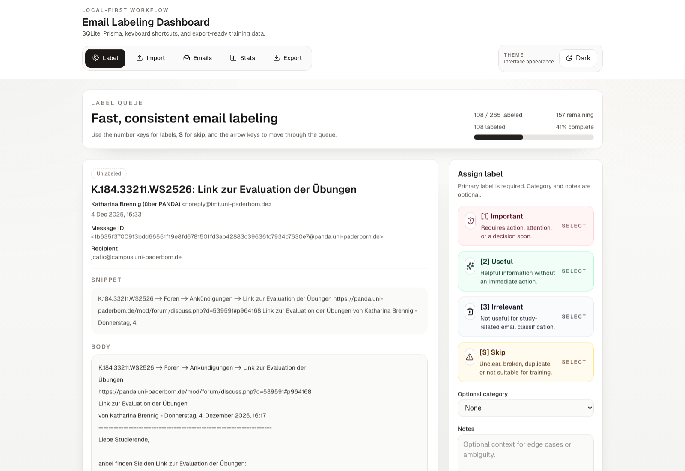
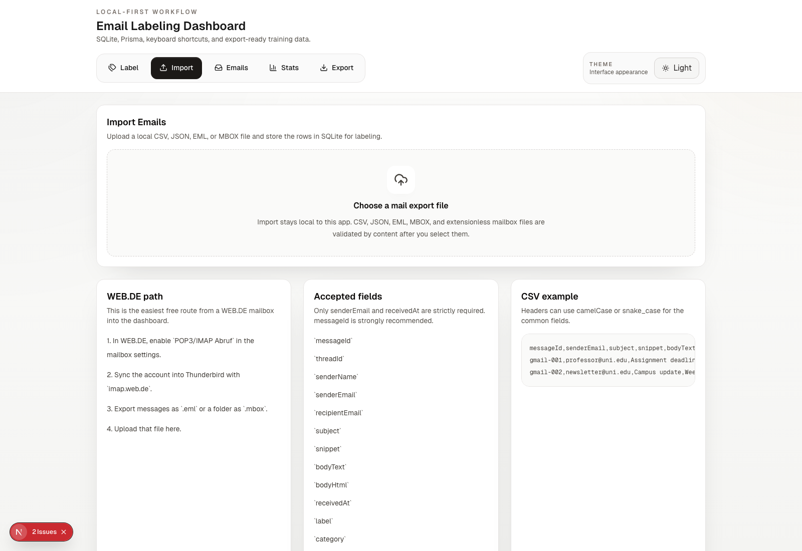
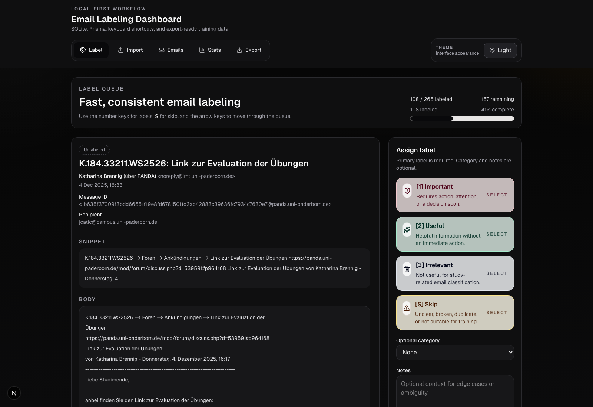

# Email Labeling Dashboard

Local-first labeling workspace for building a university email relevance dataset without any paid services, cloud storage, or hosted dependencies.


## Preview

| Labeling workspace | Import workflow |
| --- | --- |
|  |  |

<p align="center">
  
</p>

## Overview

This project is a Next.js dashboard for turning raw mailbox exports into a clean supervised learning dataset.

It is built for the stage before model training:

- import emails from local files
- review and label them quickly
- track dataset quality and class balance
- export a training-ready CSV or JSON dataset

Everything runs locally with SQLite and Prisma.

## Stack

| Layer | Choice |
| --- | --- |
| App | Next.js 16, React 19, TypeScript |
| Styling | Tailwind CSS v4 |
| Database | SQLite |
| ORM | Prisma |
| Validation | Zod |
| Mail parsing | `mailparser` |
| Data import | CSV, JSON, EML, MBOX |

## Core Features

### Fast labeling flow

- one-email-at-a-time queue at `/label`
- primary labels: `important`, `useful`, `irrelevant`, `skip`
- optional category and notes
- keyboard-first workflow:
  - `1` important
  - `2` useful
  - `3` irrelevant
  - `S` skip
  - `→` next
  - `←` previous

### Local import pipeline

- CSV and JSON import for structured data
- EML import for single saved emails
- MBOX import for Thunderbird or mailbox exports
- content-based format detection, including extensionless mailbox files

### Dataset review and editing

- searchable email explorer at `/emails`
- filter by label, category, and status
- edit labels after first pass
- pagination and direct email selection

### Stats and quality controls

- labeling progress and totals
- class counts by label and category
- recent labeling activity
- imbalance warning for ML readiness
- export excludes empty subject + empty body rows

### ML-ready export

- CSV and JSON download from `/export`
- default export excludes `skip`
- combined `text` field for simple Python training pipelines

## Product Surfaces

| Route | Purpose |
| --- | --- |
| `/label` | Main labeling workflow |
| `/import` | Local file import |
| `/emails` | Full email browser and editor |
| `/stats` | Progress and dataset quality |
| `/export` | CSV / JSON dataset download |

## Data Model

The main Prisma model is `Email`.

Important stored fields:

- `messageId`
- `threadId`
- `senderName`
- `senderEmail`
- `recipientEmail`
- `subject`
- `snippet`
- `bodyText`
- `bodyHtml`
- `receivedAt`
- `label`
- `category`
- `notes`
- `labeledAt`
- `isLabeled`
- `source`

Indexes are present for:

- `messageId`
- `label`
- `category`
- `isLabeled`
- `receivedAt`
- `senderEmail`

See [prisma/schema.prisma](./prisma/schema.prisma).

## Quick Start

### 1. Install dependencies

```bash
npm install
```

### 2. Create the local environment file

```bash
cp .env.example .env
```

### 3. Create the SQLite database

```bash
npx prisma migrate dev --name init
```

### 4. Seed sample emails

```bash
npm run db:seed
```

### 5. Start the app

```bash
npm run dev
```

Open `http://localhost:3000`.

## Importing Real Mail

The dashboard accepts:

- `.csv`
- `.json`
- `.eml`
- `.mbox`

If your email provider does not export CSV or JSON directly, the common path is:

1. enable IMAP access
2. sync the mailbox into Thunderbird
3. export messages as `.eml` or `.mbox`
4. upload them on `/import`

For the detailed WEB.DE workflow, see [docs/IMPORTING.md](./docs/IMPORTING.md).

## Labels

### Primary labels

| Label | Meaning |
| --- | --- |
| `important` | Action required, deadlines, exams, assignments, admin issues, direct instructor communication |
| `useful` | Helpful but optional information such as events, workshops, career notices |
| `irrelevant` | Low-value or unrelated messages, newsletters, ads, duplicates |
| `skip` | Unclear, broken, duplicate, or not suitable for training |

### Optional categories

- `exam`
- `deadline`
- `course`
- `admin`
- `career`
- `event`
- `newsletter`
- `system`
- `other`

## Export Format

Default ML export includes:

- `important`
- `useful`
- `irrelevant`

By default it excludes:

- `skip`
- rows where both `subject` and `bodyText` are empty

CSV columns:

```text
text,label,category,subject,senderEmail,receivedAt,id,messageId,snippet,bodyText
```

`text` is generated as:

```text
subject + "\n" + snippet + "\n" + bodyText
```

For the exact export contract, see [docs/DATASET.md](./docs/DATASET.md).

## Development Commands

```bash
npm run dev
npm run build
npm run lint
npm run db:seed
npx prisma studio
```

## Project Structure

```text
prisma/               Prisma schema, migrations, seed data
src/app/              App Router pages and API routes
src/components/       Shared UI building blocks
src/lib/              Database, validation, import/export logic
docs/                 User-facing operational documentation
```

## Local-First Constraints

- no cloud database
- no external auth provider
- no telemetry requirement
- no mandatory deployment
- exports stay local through the browser

## Known Limits

- no direct IMAP sync inside the app yet
- no multi-user auth layer
- no model training pipeline inside this repo

## Contributing

Contribution notes live in [CONTRIBUTING.md](./CONTRIBUTING.md).
